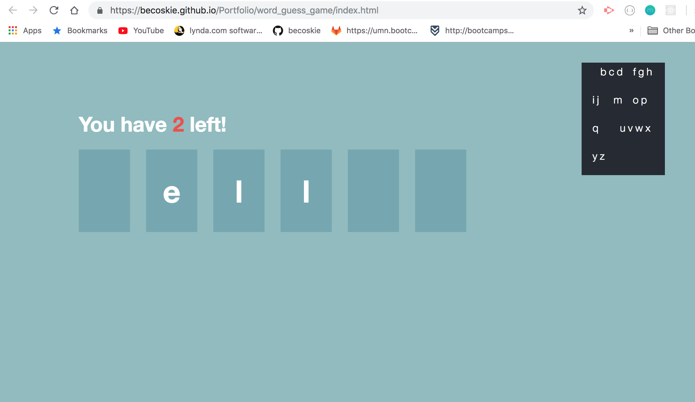

# Ken and Ken's Colors

Random words are generated and the user receives a number of chances to guess the word based on word length, shown by tiles. If the input is correct a tile shows the correct letter, if the guess is wrong it gets removed from the alphabet container, the user's chances are reduced by one and the game wins a point. If the user fails to guess the word, the game wins and goes on to the next question, leaving the word available for another round. If the user guesses correctly, the word is removed from the data, the tiles change color, a song snippet plays and a win is added to the player's score.

[Live Link](https://becoskie.github.io/Portfolio/word_guess_game/index.html)

### The Build

1. Vanilla Javascript
2. Json
3. Bootstrap
4. HTML
5. CSS
6. Ken Nordine's Colors

## Screenshots

**Article search and results**

## Acknowledgments
1. Ken Nordine for inspiration
2. Whoever wrote the sweet code to itterate through a word like 'scissors' finding all the occurrences
3. The person I pinched the graphic from. It's on the internet somewhere.

### Brown... that's a good color. 
